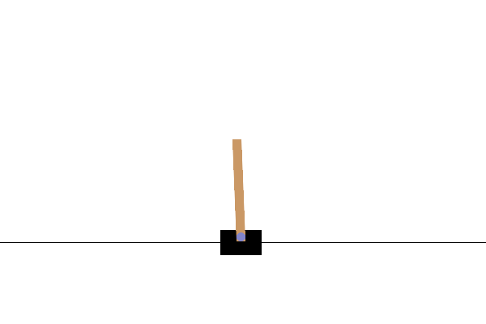
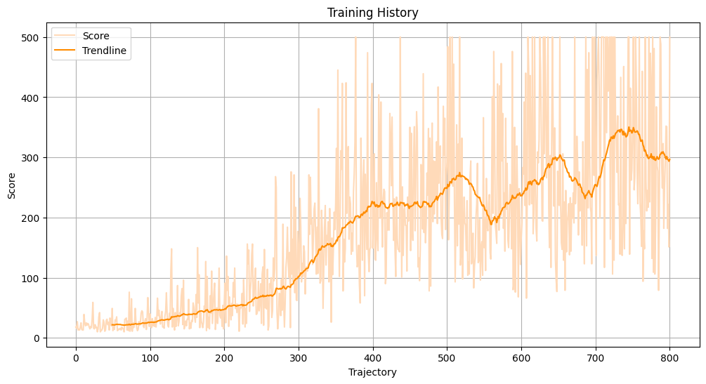
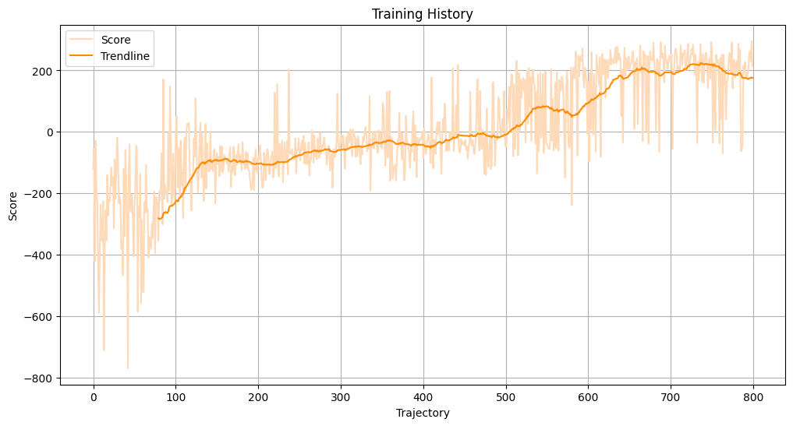
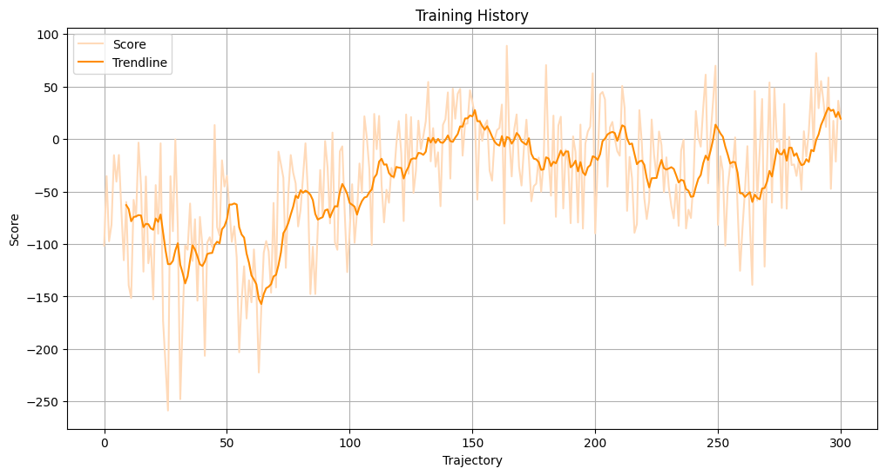
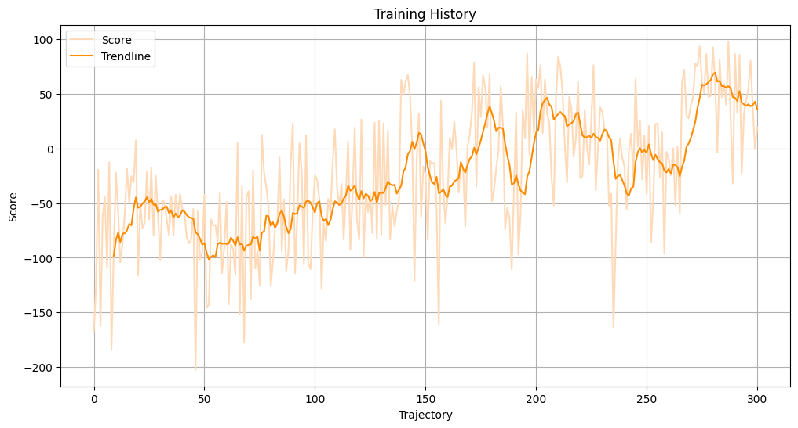

## Reinforcement Learning with Gymnasium

Implementations of reinforcement learning algorithms `01. VPG.ipynb`, `02. DQN.ipynb`, `03. A2C.ipynb`, `04. PPO.ipynb`, `05. DDPG.ipynb` for OpenAI Gym environments `CartPole-v1`, `LunarLander-v2`, `BipedalWalker-v3`

|  |  |  |
|:--------------------------------------------------:|:--------------------------------------------------:|:--------------------------------------------------:|


### 01. Vanilla Policy Gradient (VPG)

Vanilla Policy Gradient (VPG) is a reinforcement learning algorithm that optimizes a policy by directly maximizing the expected return:

```math
J(\theta) = \mathbb{E}_{\tau \sim \pi_\theta} [R(\tau)]
```

Here, $\tau$ denotes a trajectory and $R(\tau)$ is the return along the trajectory $\tau$.

To find the optimal policy parameters, we compute the gradient of $J(\theta)$ with respect to $\theta$.  
This gradient is

```math
\nabla_\theta J(\theta) = \mathbb{E}_{\tau \sim \pi_\theta} [\nabla_\theta R(\tau)]
```

Using the log-likelihood trick, we can rewrite the gradient as

```math
\nabla_\theta J(\theta) = \mathbb{E}_{\tau \sim \pi_\theta} \left[\sum_{t=0}^T \nabla_\theta \log \pi_\theta(a_t|s_t) \cdot R_t\right]
```

Thus, the gradient contribution from a single trajectory is

```math
\sum_{t=0}^T \nabla_\theta \log \pi_\theta(a_t|s_t) \cdot R_t
```

In the following implementation, this is seen in `Agent.learn`:

```python
for log_prob, R_t in zip(log_probs, returns):
    loss.append((-log_prob * R))
L = torch.cat(loss).sum()

```

Directly afterwards, the policy is trained to maximize returns via gradient descent:

```python
self.optimizer.zero_grad()
L.backward()
self.optimizer.step()
```


In practice, trajectories $\tau$ are sampled using monte carlo methods which involve sampling and averaging multiple trajectories of the policy:

```python
n_trajectories = 800
for i in range(n_trajectories + 1):

    . . .

    T = 1000
    for t in range(1, T+1):

    . . .

```

The full implementation of the algorithm is in `01. VPG.ipynb`.

**Observed Training Results:**




### 02. Deep QNetwork (DQN)

Deep Q-Network (DQN) is a reinforcement learning algorithm that uses a neural network `QNetwork` to approximate the optimal action-value function:

```math
Q(s, a) = \mathbb{E}[r + \gamma \max_{a'} Q(s', a') | s, a]
```

To do this, we use two neural networks: a local network and a target network. The local network is updated during the training process while the target network is used to compute targets during the training process. This approach addresses the moving target problem, where updates to the network cause targets to shift, potentially leading to oscillations or divergence in the training process.

To train the local network, we compute $Q_{\theta}(s,a)$ using the local network and we compute a target value $Q_{\text{target}} = r + \gamma \max_{a'} Q_{\theta'}(s',a')$ using the target network. Although these targets may not be very accurate at the beginning of the training process, the reward $r$ in the formula and regular soft updates from the local network to the target network gradually move the learning process in the right direction.

Now, the local network is trained by minimizing the difference between the predicted Q-values and the target Q-values:

```math
L(\theta) = \mathbb{E}_{(s, a, r, s') \sim \mathcal{D}} \left[ \left( r + \gamma \max_{a'} Q_{\theta'}(s', a') - Q_\theta(s, a) \right)^2 \right]
```

Here, $\gamma$ is the discount factor; $\theta$ and $\theta'$ represent the parameters of the local network and target networks, respectively; and $\mathcal{D}$ denotes the replay buffer that stores experience tuples $(s, a, r, s')$ for training.

In the following implementation, the loss is computed in `Agent.learn`:

```python
Q_targets_next = self.QNetwork_target(next_states).detach()
Q_targets = rewards.unsqueeze(1) + (self.gamma * Q_targets_next * (1 - dones.unsqueeze(1)))
Q_predicted = self.QNetwork_local(states).gather(1, actions)

loss = self.criterion(Q_predicted, Q_targets)
```

Directly afterwards, the network is updated via gradient descent:

```python
self.optimizer.zero_grad()
loss.backward()
self.optimizer.step()
```

Furthermore, soft updates are regularly pushed from the local network to the target network every $n$ steps to improve the accuracy of the targets:

```python
for param_target, param_local in zip(self.QNetwork_target.parameters(), self.QNetwork_local.parameters()):
            param_target.data.copy_(self.tau * param_local.data + (1.0 - self.tau) * param_target.data)
```

In practice, instead of training the network on consecutive state transitions, which can cause correlations in updates and inefficient learning, DQN uses a `ReplayBuffer` for experience replay. This approach randomly samples past experiences, thereby breaking correlations and improving learning efficiency:

```python
experiences = random.sample(self.memory, k=self.batch_size)
```

#### Further Enhancements To Implementation:

**Duelling DQN**

A `DuelingQNetwork` is an enhancement to the `QNetwork` architecture that separates $Q(s,a) = V(s) + A(s,a)$ into two streams to predict state values $V(s)$ and to predict action advantages $A(s,a)$ (how action $a$ compares to other actions in state $s$). To ensure that $A$ is centered around 0/avoid redundant information/etc., we use $Q(s,a) = V(s) + (A(s,a) - \text{mean}_{a}A(s,a))$.

```python
class DuelingQNetwork(nn.Module):

    def __init__(self, n_obs_dim: int, n_action_dim: int, n_hidden_1_dim=64, n_hidden_2_dim=64):
        super().__init__()
        self.fc1 = nn.Linear(n_obs_dim, n_hidden_1_dim)
        self.fc2 = nn.Linear(n_hidden_1_dim, n_hidden_2_dim)
        
        self.value_stream = nn.Sequential(
            nn.Linear(n_hidden_2_dim, 1)
        )
        
        self.advantage_stream = nn.Sequential(
            nn.Linear(n_hidden_2_dim, n_action_dim)
        )

    def forward(self, x: torch.Tensor) -> torch.Tensor:
        x = F.relu(self.fc1(x))
        x = F.relu(self.fc2(x))

        value = self.value_stream(x)

        advantage = self.advantage_stream(x)
        
        Q_value = value + (advantage - advantage.mean(dim=1, keepdim=True))

        return Q_value
```

**Double DQN** 

Double DQN improves upon standard DQN by using the policy network for action selection and the target network for action evaluation, reducing overestimation bias in Q-value estimates: 

```python
next_actions = self.QNetwork_local(next_states).detach().max(1)[1].unsqueeze(1)
Q_targets_next = self.QNetwork_target(next_states).gather(1, next_actions).detach()
Q_targets = rewards.unsqueeze(1) + (self.gamma * Q_targets_next * (1 - dones.unsqueeze(1)))
```


The full implementation of the algorithm is in `02. DQN.ipynb`.

**Observed Training Results:**



### 03. Advantage Actor-Critic (A2C)

> It was previously thought that the combination of simple online reinforcement learning algorithms with deep neural networks was fundamentally unstable. (. . .) \[T\]he sequence of observed data encountered by a online reinforcement learning agent is non-stationary and updates are strongly correlated. By storing the data in an experience replay memory, the data can be batched or randomly sampled from different time steps. Aggregating over memory in this way reduces non-stationarity and decorrelates updates but at the same time limits the methods to off-policy reinforcement learning algorithms. (. . .) In this paper, we provide a very different paradigm for deep reinforcement learning. Instead of experience replay, we asynchronously execute multiple agents in parallel on multiple instances of the environment. This parallelism also decorrelates the data into a more stationary process since at any given time step the parallel agents will be experiencing a variety of different states. This simple idea enables a much larger spectrum of fundamental on-policy reinforcement learning algorithms...
>
> *Asynchronous Methods for Deep Reinforcement Learning*, Mnih et al. (2016)


Advantage Actor-Critic (A2C) is a reinforcement learning algorithm that combines policy gradient methods and value function approximation. The algorithm uses two networks: a `PolicyNetwork` (or actor) and a `ValueNetwork` (or critic). Here, the actor models the policy while the critic estimates the value function to adjust the policy gradient for the actor during training. The algorithm updates both models simultaneously during the training process.

A2C maximizes the expected return by using the advantage function  $A(s_t,a_t)$ to adjust the policy gradient.  
The advantage function is defined as the difference between the return and the baseline value estimated by a value function $V(s_t)$:

```math
A(s_t, a_t) = R_t - V(s_t)
```

The policy gradient (as previously seen in VPG) is then adjusted as follows:

```math
J(\theta) = \mathbb{E}_{\tau \sim \pi_\theta} \left[\sum_{t=0}^T \log \pi_\theta(a_t \mid s_t) \cdot A(s_t, a_t)\right]
```

In the following implementation, advantages are computed in `Agent.compute_gae_advantages`:

```python
deltas = rewards + self.gamma * torch.cat([values[1:], torch.zeros(1)]) - values

advantage = 0
advantages = torch.zeros_like(deltas)
    for t in reversed(range(len(deltas))):
        advantage = deltas[t] + self.gamma * self.lambda_GAE * advantage
        advantages[t] = advantage
```

Observe that advantages are calculated using state values generated by the value network.

These advantages are then used to update the policy in `Agent.learn`:

```python
policy_loss = -(log_probs * advantages).mean()
self.optimizer_policy.zero_grad()
policy_loss.backward()
self.optimizer_policy.step()
```

The value network is updated simultaneously:

```python
value_loss = F.mse_loss(V_predicted, V_targets)
self.optimizer_policy.zero_grad()
value_loss.backward()
self.optimizer_policy.step()
```

In practice, A2C leverages multiple parallel environments to sample trajectories in a non-sequential manner:

```python
n_envs = 4
env_fns = [lambda: gym.make("LunarLander-v2") for _ in range(n_envs)]
envs = SyncVectorEnv(env_fns)

n_trajectories = 1000 // n_envs
for i in range(n_trajectories + 1):

    . . .

    T = 1000
    for t in range(T):

        . . .

        for j in range(n_envs):

            . . .

```


The full implementation of the algorithm is in `03. A2C.ipynb`.

**Observed Training Results:**



### 04. Proximal Policy Optimization (PPO)

Proximal Policy Optimization (PPO) is an extension of A2C. The approach is derived from an earlier algorithm Trust Region Policy Optimization (TRPO).

**Trust Region Policy Optimization (TRPO)**

TRPO is a reinforcement learning algorithm designed to improve the stability of policy gradient methods. It addresses the issue of large destabilizing policy updates by imposing the constraint that the new policy does not deviate considerably from the old policy. The central idea is to optimize the policy within a "trust region" which is defined by a constraint on the Kullback-Leibler (KL) divergence between the new policy and old policies:

```math
J(\theta) = \text{max}_\theta \ \mathbb{E}_{\tau \sim \pi_{\text{old}}} \left[\sum_{t=0}^T \text{log} \pi_\theta(a_t \mid s_t) \cdot A(s_t, a_t)\right]
```

Where

```math
\mathbb{E}_{\tau \sim \pi_{\text{old}}} \left[\text{KL} \left[\pi_{\text{old}}(a_t \mid s_t) \| \pi_\theta(a_t \mid s_t)\right]\right] \leq \delta
```

Here, $\delta$ is a small constant that controls the size of the trust region.

**Proximal Policy Optimization (PPO)**

PPO simplifies TRPO by imposing the constraint that the new policy does not deviate considerably from the old policy without the need for complex optimization constraints. PPO uses a surrogate objective function that incorporates a clipping mechanism to limit the size of policy updates:

```math
\mathcal{L}(\theta) = \mathbb{E}_{t} \left[ \text{min} \left( r_t(\theta) \cdot A_t, \ \text{clip} \left(r_t(\theta), 1 - \epsilon, 1 + \epsilon \right) \cdot A_t \right) \right]
```

Where

```math
r_t(\theta) = \frac{\pi_\theta(a_t \mid s_t)}{\pi_{\text{old}}(a_t \mid s_t)}
```

Here, $\epsilon$ is a small constant that controls the clipping range.

In the following implementation, this is computed in `Agent.learn`:

```python
surr1 = ratios * advantages
surr2 = torch.clamp(ratios, 1.0 - self.clip_epsilon, 1.0 + self.clip_epsilon) * advantages
policy_loss = -torch.min(surr1, surr2).mean()
```

In practice, `Agent.k_epochs` refer to the number of times the algorithm updates its policy with the same batch of data. This approach helps to make efficient use of collected data and stabilizes training by refining the policy through repeated optimization while avoiding drastic updates.

The full implementation of the algorithm is in `04. PPO.ipynb`.

**Observed Training Results:**



### 05. Deep Deterministic Policy Gradient (DDPG)

Deep Deterministic Policy Gradient (DDPG) is a reinforcement learning algorithm that uses actor-critic methods (as seen in A2C); however, DDPG builds on the actor-critic framework by combining actor-critic methods with strategies from Q-learning (like DQN). Here, the `Critic` models the action-value function $Q_{\theta}(s,a)$ instead of $V(s_t)$ from A2C. The algorithm also incorporates several features from DQN including the use of a `ReplayBuffer` for experience replay and the use of soft updates and target networks for both the `Actor` and the `Critic`.

In practice, Ornstein-Uhlenbeck noise `OUNoise` is often used to encourage exploration in DDPG. Ornstein-Uhlenbeck noise is a stochastic process that generates noise with specific characteristics: 1) Mean Reversion: The characteristic that the noise reverts to a central value over time (preventing noise from drifting too far) and 2) Temporal Correlation: The characteristic that noise values are correlated over time (encouraging smooth transitions rather than abrupt changes).

The Ornstein-Uhlenbeck process is mathematically defined by the following stochastic differential equation:

```math
    d\mathbf{x}_t = \theta (\mu - \mathbf{x}_t) \, dt + \sigma \, d\mathbf{W}_t
```

Where

$\theta (\mu - \mathbf{x}_t)$ is the mean reversion term that ensures that the noise $\mathbf{x}_t$ reverts to the mean $\mu$.

And

$\sigma \, d\mathbf{W}_t$ is the randomness term that introduces randomness from a normal distribution scaled by $\sigma$.

In the following implementation, this is seen in `OUNoise`:

```python

class OUNoise:
    def __init__(self, action_dim, mu=0.0, theta=0.2, sigma=0.3):
        self.action_dim = action_dim
        self.mu = mu
        self.theta = theta
        self.sigma = sigma
        self.reset()

    def reset(self):
        self.state = np.ones(self.action_dim) * self.mu

    def sample(self):
        dx = self.theta * (self.mu - self.state) + self.sigma * np.random.randn(self.action_dim)
        self.state += dx
        return self.state

```

**Further Enhancements: Twin Deep Deterministic Policy Gradient (TD3)**

DDPG can suffer from overestimation bias in the critic network (similar to issues seen in DQN). TD3 addresses this issue by using two seperate critic networks and updating the polist using the minimum value between the critics, reducing the risk of overestimation (similar to Double DQN). Furthermore, TD3 introduces policy smoothing where small noise is added to target actions to prevent the critic from becoming overaly optimistic about specific actions. Additionally, TD3 introduces delayed policy updates where the `Actor` is updated less frequently than the `Critic`, allowing the action-value estimates to stabilize before updating the policy.

The full implementation of the algorithm is in `05. DDPG.ipynb`.

### References:

1. **Spinning Up in Deep Reinforcement Learning.** OpenAI. Available at: https://spinningup.openai.com/en/latest/.

2. **Key Papers in Deep Reinforcement Learning.** OpenAI. Available at: https://spinningup.openai.com/en/latest/spinningup/keypapers.html.

3. **Reinforcement Learning By The Book.** Mutual Information. Available at: https://www.youtube.com/playlist?list=PLzvYlJMoZ02Dxtwe-MmH4nOB5jYlMGBjr
